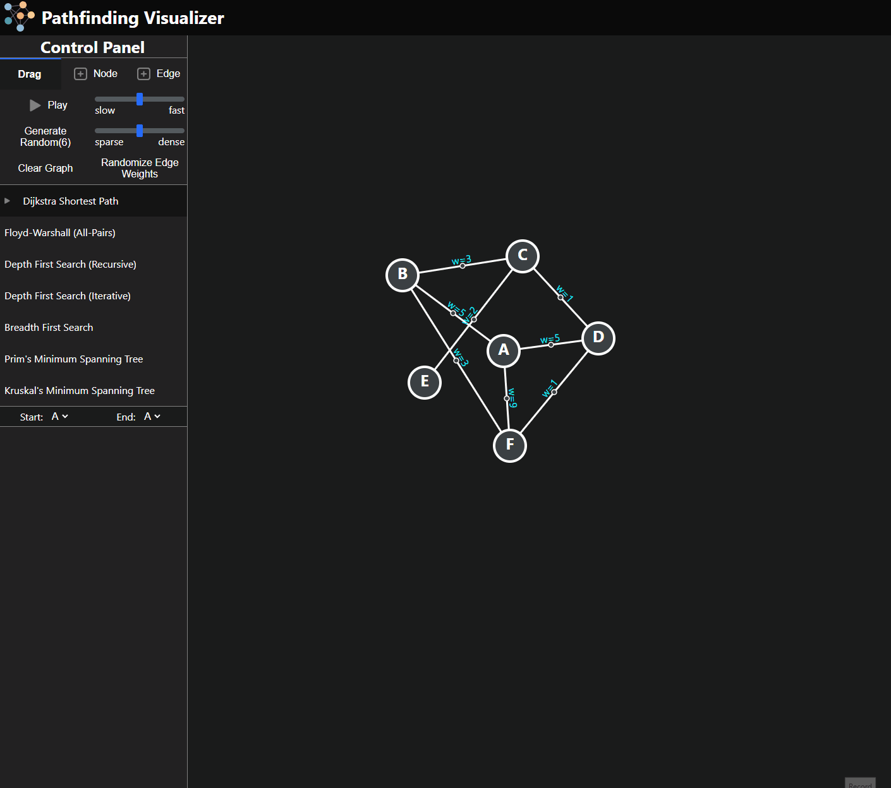

# pathfinding-visualizer

## Interactive visualization tool for pathfinding and graph traversal.

Version 2 of Pathfinding Visualizer. This project enables users to create custom graphs and apply various algorithms for pathfinding and graph traversal.

Version 2 changes:

- Updated control panel
- Pannable canvas
- Random Graph Generation density options
  - Sparse
  - Dense
- Edge weight randomizer
- Draggable nodes while playing
- Play can be stopped
- Solution persists after completion
- UI changes

### Algorithms:

1. Dijkstra Shortest Path
2. Floyd-Warshall (All-Pairs)
3. Depth First Search (Recursive)
4. Depth First Search (Iterative)
5. Breadth First Search
6. Prim's Minimum Spanning Tree
7. Kruskal's Minimum Spanning Tree

## Usage

- Go to https://pathfinder-v2-rho.vercel.app/
- Pick algorithm of choice
- Change Edge weights with Randomize Edge Weights
- Choose start and end points
- Use the +Edge option, then click and drag between two nodes to create a new edge
- Use the +node option to create a new node
- Press Play to visualize

